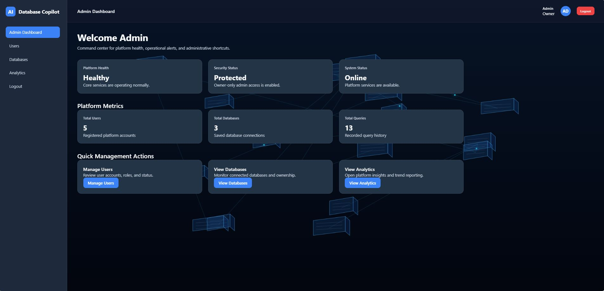
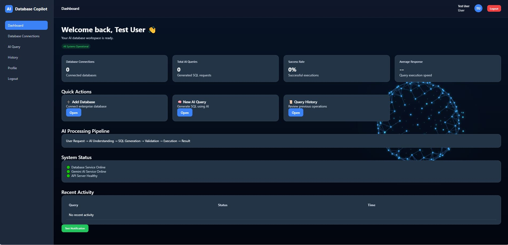
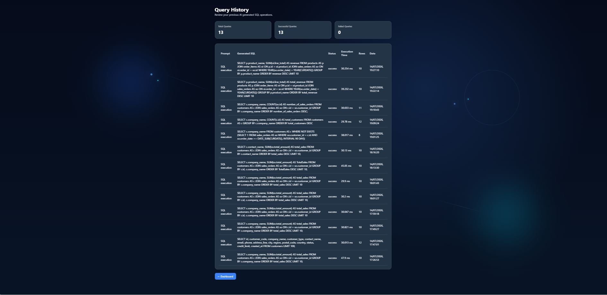
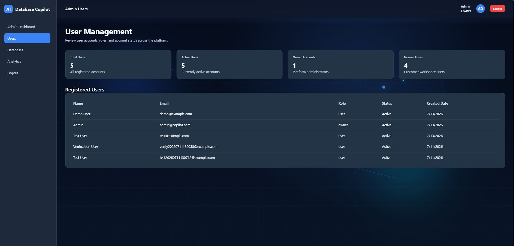

## Demo

The demo shows the core AI Query workflow of AI Database Copilot.

In this demonstration:

- User logs into the platform
- Opens the AI Query Workspace
- Selects a connected database
- Enters a natural language question
- Generates SQL using Gemini AI
- Reviews the generated SQL query
- Executes the query securely
- Views the returned database results

## Application Screenshots

The following screenshots demonstrate different parts of the AI Database Copilot platform, including user workflows, administration features, and query management.

### Admin Dashboard

### User Dashboard

### Query History Management

### User Management

